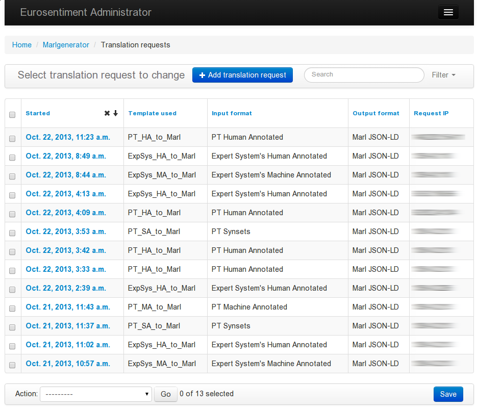

Eurosentiment Generator
=======================

Introduction
------------

The purpose of the EUROSENTIMENT Generator is to translate information
from legacy or non-semantic formats to the semantic formats used in
EUROSENTIMENT.

The Generator has been tested with the corpora for sentiment and emotion
analysis from the members of the consortium (mainly from Expert System
and Paradigma Tecnológico). These corpora have been transformed to
JSON-LD, using the Marl and Onyx vocabularies. Nevertheless, the
Generator was designed as a generic tool to translate from and to a wide
range of formats and vocabularies or ontologies.

Translating a document does not require any technical qualification. The
translation of documents can be done through a web portal. This is
especially useful for demonstration and testing purposes or quick
translations. However, in a real life scenario, there will be a big
amount of information and files to be translated. Also, it should be
possible to integrate our Generator in a pipeline or automated process,
so that new content can be automatically converted. For these reasons,
the Generator also exposes a REST API. It only takes a POST request to
translate a document.

The Generator has been designed to be extensible and to separate the
technical aspects from the content and formats being translated. Our
Generator itself is a convenient platform, but the actual translation is
performed following a set of "Translation Templates". These templates
have access to the data in the original file, and determine the result
of the translation.

An administrative web interface has been developed to make it easy to
add new formats, improve translation templates or access the usage
statistics.

Architecture
------------

As can be seen in the figure below, the Generator is made out of A Web
Server proxies all the user requests to the Request Processor. This
processor is a Django application that has two roles: providing a REST
and an Administrative interface. On the administrative side it deals
with authorisation and authentication of users. It also stores the
translation templates provided by the staff in the database On the REST
side, it forwards all valid user translation requests to the Translator
module. This module opens the original file in any of the supported
formats, it applies the requested translation template with its content,
and then returns the resulting document.

Translation Templates
---------------------

For convenience, we used an easy-to-use templating language and engine
for the Generator called `Jinja2 <http://jinja.pocoo.org/docs/>`__.
Despite its user-friendliness, it is a really powerful language. It
features advanced loops, conditional clauses, functions and filters. It
is essentially a stripped-down or subset of Python.

The file contents can be accessed from within the template like a stream
or iterator. The Translator reads the original document, feeding it line
by line (for plain text) or row by row (in spreadsheet files). Then,
using Jinja2, it is easy to iterate over it and extract all the relevant
information.

In addition to all the basic filters in Jinja2, the EUROSENTIMENT
templates can also use a set of specific filters that make it easier to
tokenise the input.

The annex contains a complete template.

Supported Formats
-----------------

As of this writing, the EUROSENTIMENT Generator accepts corpora in the
following formats:

-  Paradigma Tecnológico's Human Annotated Corpora
   (Tab-Separated-Values)
-  Paradigma Tecnológico's Machine Annotated Corpora
   (Tab-Separated-Values)
-  Paradigma Tecnológico's Synset-Aligned Corpora (Tab-Separated-Values)
-  Expert System's Machine Annotated Corpora (Microsoft Excel)
-  Expert System's Human Annotated Corpora (Microsoft Excel)
-  Expert System's Corpora with Emotions (Microsoft Excel)
-  TripAdvisor corpora (Raw text with custom tags)

Usage
-----

Translating a document
----------------------

Documents can be translated via the Web Interface or using the REST
interface. Actually, the form in the Web is simply a convenient way of
accessing the REST interface which shows all the available templates and
a field to upload the desired file.

   Translating a document through the web
The Generator endpoint takes the following parameters:

-  input (i): The original file to be translated
-  informat (f): The format of the original file
-  intype (t) [Optional]:

   -  direct (default)
   -  url
   -  file

-  outformat (o):

   -  json-ld
   -  rdfxml
   -  turtle (default, to comply with NIF)
   -  ntriples
   -  trix

-  base URI (u) [Optional]: base URI to use for the corpus
-  prefix (p) [Optional]: prefix to replace the base URI
-  template (t) [Optional]: ID of the template to use. If it is omitted,
   a template to convert from informat to outformat will be used, or a
   template from informat to another format (e.g. json-ld), with
   automatic conversion.
-  toFile [Optional]: Whether the result should be sent in the response
   (default) or written to a file. For convenience, this value defaults
   to False when using the Web Form.

Using the command line tool *curl*, a request can be made like this:

.. code-block:: bash

    curl http://demos.gsi.dit.upm.es/eurosentiment/marlgenerator/process -F"intype=file" -F"informat=Example" -F"outformat=jsonld" -F"input=@input-file.csv" > result.jsonld

Adding a template
-----------------

Editing a template is simple. First, visit the administration URL. If it
is your first login or if your session expired, you will be greeted by a
login screen:

   Login prompt
Just enter your username and password, and the administration interface
should appear.

   Administration Interface

   Editing a template
It is also possible to add a format from this menu, clicking on the
"Plus" icon:

   Adding a format on the fly
Checking usage statistics
-------------------------

Once logged in as a superuser, you can also add new users and check the
requests that have been made for each format.

   Superuser panel
To check the requests, click on "Translation Requests" in the
administration panel.

   Log of requests
In addition to simply checking the requests, it is also possible to
filter the requests using different parameters. This feature is
especially useful if you want to study the popularity of a format, or to
compare different templates for the same formats.

   Filtering requests

Example Template
----------------

.. code-block:: javascript

    {
        "@context": [
            "http://demos.gsi.dit.upm.es/eurosentiment/static/context.jsonld",
        ],
        "@id": "{{ linesplit(f.name,"/")[-1] }}",
        "analysis": [
            {
                "@id": "{{ linesplit(f.name,"/")[-1] }}#MachineAnnotated",
                "@type": [
                    "marl:SentimentAnalysis"
                ],
            
                "dc:language": "{{ language}}",
            
                "marl:maxPolarityValue": 10.0,
                "marl:minPolarityValue": 0.0,
                "prov:wasAssociatedWith": "pt:agent"
            }
        ],
        "entries": [
    
    
    {% set node="_:BlankNode%s" % loop.index %}
    
    
    
            {
                "@id": "{{ node }}",
                "opinions": [
                    {

    
                         "marl:polarityValue": {{ pol }},
    
                         "marl:hasPolarity": "marl:Positive"
    
                         "marl:hasPolarity": "marl:Negative"
    
                         "marl:hasPolarity": "marl:Neutral"
    
    
                    }
                ],
                "nif:isString": {{ text | escapejs }},
                "strings": [
                  
                  {
                  
                  "nif:anchorOf": {{ parts[0] | escapejs }},
                  "nif:posTag": "pt:{{ parts[1] }}",
                  "nif:lemma": {{ parts[2] | escapejs }} }
                  , 
                ]
            }  , 
    
        ]
    }

