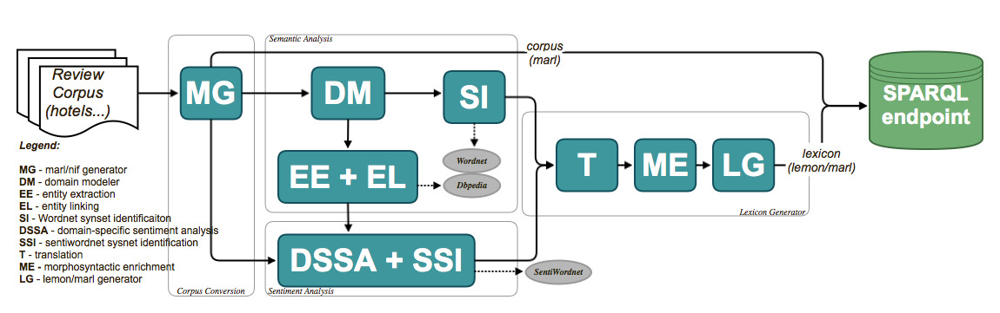

Language Resource Adaptation Pipeline
=====================================

In this section we describe the Language Resource Adaptation Pipeline various components and provides links to the source code for these components.

The Language Resource Adaptation Pipeline (a.ka. LRAP) implements a methodology for legacy language resource adaptation that generates domain-specific sentiment lexicons organized around domain entities described with lexical information and sentiment words described in the context of these entities. 

The outcome of the Language Resource Adaptation Pipeline are annotated corpora represented the NIF/Marl format and domain-specific sentiment lexicons represented in RDF using the Lemon/Marl format. The legacy language resources are enriched with semantics and additional linguistic information from resources like DBpedia and BabelNet. 

There are four main steps of the LRAP as shown in the Figure bellow: 

1. **Corpus Conversion**: normalizes the different language resources to a common schema based on Marl and NIF; The corpus convertor tool was described earlier in a separate section.

2. **Semantic Analysis**: extracts the domain-specific entity classes and named entities and identifies links between these entities and concepts from the LLOD Cloud. The Semantic Analysis step consists of: `Domain Modeller (DM) <https://github.com/insight-unlp/domainmodeller>`_, `Entity Extraction (EE), Entity Linking (EL) <https://dl.dropboxusercontent.com/u/17176685/EUROSENITMENT-code/aela-eurosentiment0.3.tar.gz>`_ and Synset Identification (SI) components. 

3. **Sentiment Analysis**: extracts contextual sentiments and identifies SentiWordNet synsets corresponding to these contextual sentiment words. The Sentiment Analysis step consists of: `Domain-Specific Sentiment Polarity Analysis (DSSA) and Sentiment Synset Identification (SSI) <https://www.dropbox.com/s/henii3iyigjf92l/wnsd-1.2-full.tar.gz>`_ components.

4. **Lexicon Generator**: uses the results of the previous steps, enhances them with multilingual and morphosyntactic information and converts the results into a lexicon based on the lemon and Marl formats. The Lexicon Generator step consists of: `MorphoSyntactic Enrichment (ME) <https://dl.dropboxusercontent.com/u/17176685/EUROSENITMENT-code/morphosyntactic.zip>`_, `Machine Translation(T) <git://github.com/moses-smt/mosesdecoder.git>`_ and `lemon/Marl Generator(LG) <https://dl.dropboxusercontent.com/u/17176685/EUROSENITMENT-code/LemonMarlGenerator.zip>`_ components. 

Different language resources are processed with variations of the given adaptation pipeline. 
For more details on the LRAP and the domain-specific lexicons it generates please check our dissemination material:

* Presentatin at 5th International Workshop on EMOTION, SOCIAL SIGNALS, SENTIMENT & LINKED OPEN DATA: "Generating Linked-Data based Domain-Specific Sentiment Lexicons from Legacy Language and Semantic Resources" - Gabriela Vulcu, Paul Buitelaar, Sapna Negi, Bianca Pereira, Mihael Arcan, Barry Coughlan, Fernando J. Sanchez and Carlos A. Iglesias

* Poster at the Data Challenge at the 3rd Workshop on Linked Data in Linguistics "Linked-Data based Domain-Specific Sentiment Lexicons" - Gabriela Vulcu, Raul Lario Monje, Mario Munoz, Paul Buitelaar and Carlos A. Iglesias
