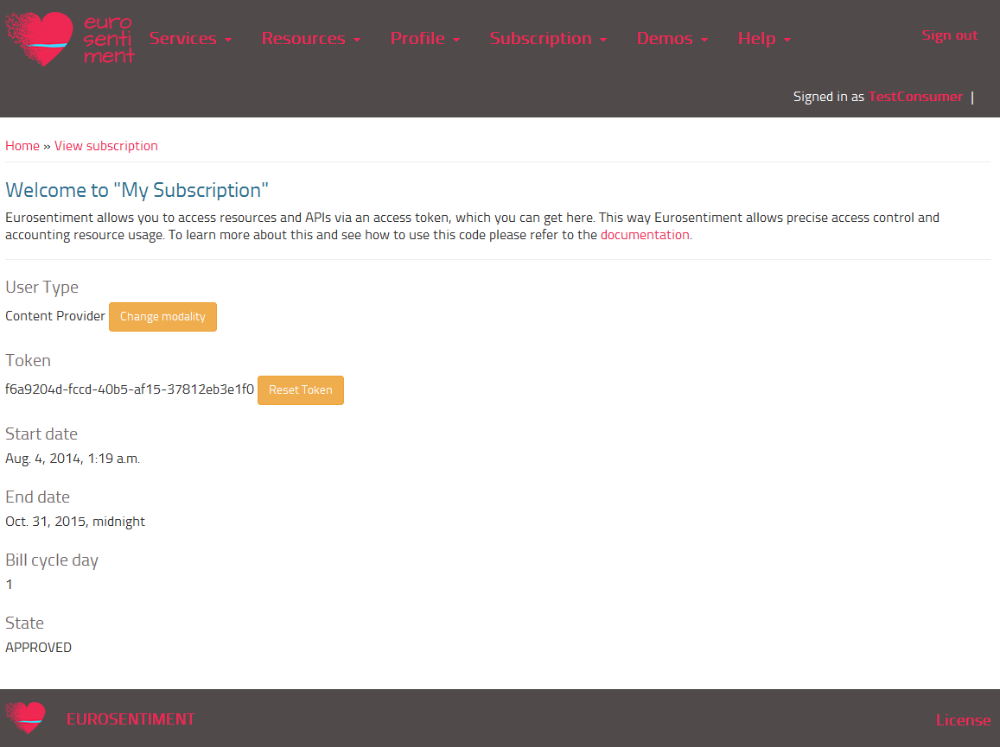
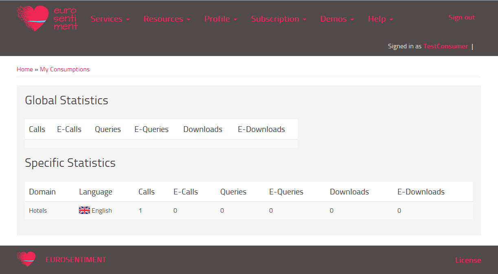
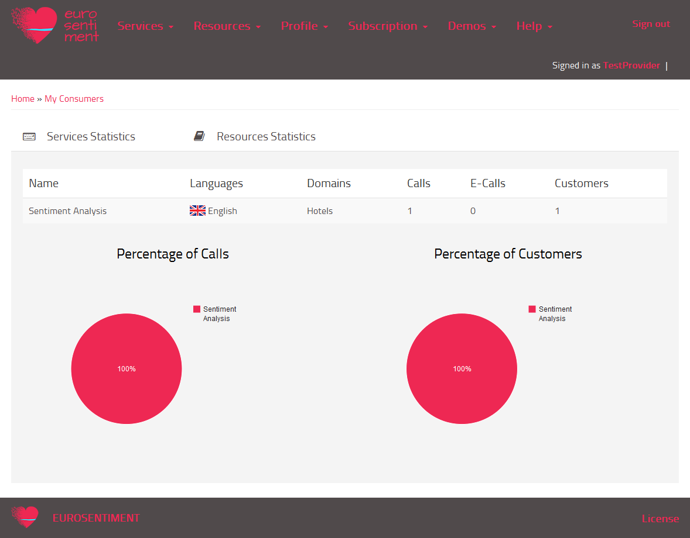
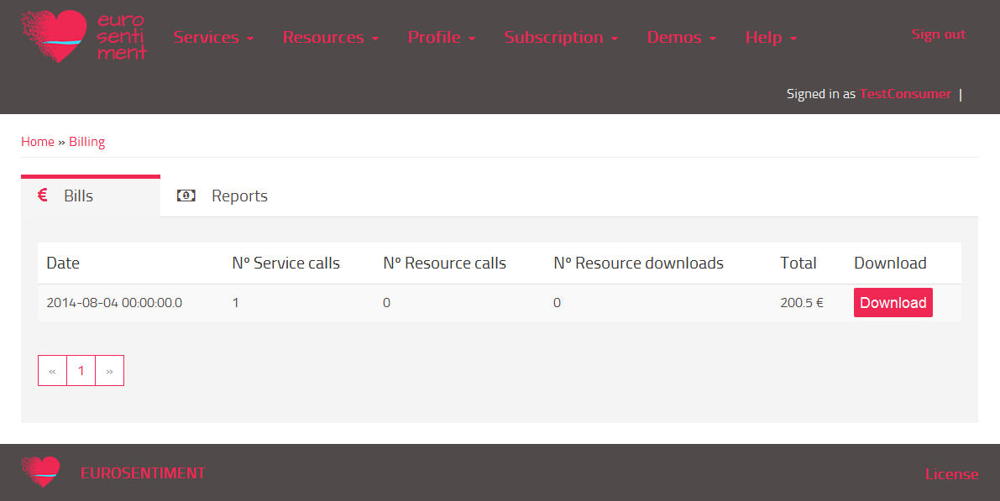
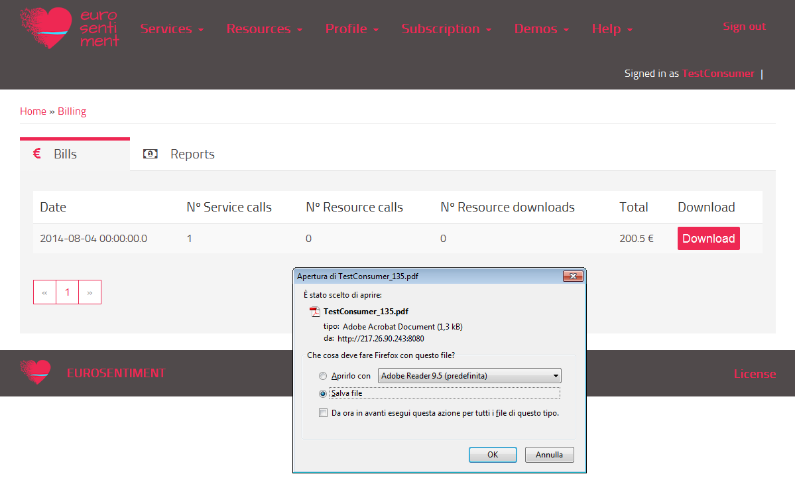

Managing Subscriptions
======================

In this menu, the users can check their account subscription, their activities in consuming/producing services and resources, and their bills/reports.

My Subscription
---------------
By clicking on **Subscription -> My Subscription**, users are presented with this page:

In this page, users can see:

* Their type of account (Language Resource Owner or Service Developer or Content Provider)

    .. figure:: _static/img/Subscription2.png
* Their personal access token;

    .. figure:: _static/img/Subscription3.png
* The account registration start/end date, the day of their monthly bill calculation and the status of their account.

    .. figure:: _static/img/Subscription4.png

Users can change the type of their account or reset the token whenever, through the **Change modality** and **Reset token** buttons.

My Consumptions
----------------
In the section **Subscription -> My consumptions** consumers can see their own statistics:

 

Every time that users access a language resource or an analysis service, the system tracks this access by exploiting the personal access token; once a day, the stats module reads the logs and calculates the statistics.

The section **Subscription -> My consumers** shows the consumptions by other users of the resources/services belonging to the current user.

Billing
-------
In the section **Subscription -> Billing** the consumer can see his own bills:

The picture above shows the bills of a user; the tabs allow the user to see revenue reports too. In this case, the user hasn't  registered any services/resources, so the reports contain **zero** in every field. The total amount of fees is the result of the sum between the subscription fees (200) and the consuming fees (0,5).
The billing module exploits the logs for calculating the bills. The calculation is performed once a month, when the current day is the same of the day of the account registration date: for each account, the billing module calculates a bill and a revenue report.

Users can download their bills/reports:

